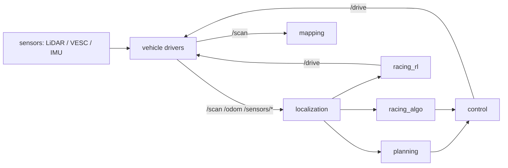

# Architecture

This document describes how the monorepo is organized and the reasoning behind
the major decisions. Decisions are justified on their technical merits.

## Goals

1. Let multiple people work on different parts of the stack independently off a
   single `develop` trunk.
2. Support two racing stacks — reinforcement-learning (RL) and algorithmic — that
   share common modules (mapping, localization, perception).
3. Allow the RL end-to-end model to run standalone if desired.
4. Build `develop` into a generic, snapshot-able image that loads directly onto
   the on-car Jetson, while a car keeps its own params/config separate.

## Why a single monorepo

- One clone, one PR can span a change to the observation contract, the reward, and
  the on-car inference node together — atomic, reviewable changes.
- Shared modules (mapping/localization) are reused by both racing stacks without
  cross-repo version juggling.
- A single source of truth for the code that becomes the car image.

The main cost of a monorepo — heavy artifacts bloating the repo — is avoided by
keeping training outputs, rosbags, weights, maps, and build trees out of git (see
[`.gitignore`](.gitignore)). Training is GPU-heavy but runs on developer machines
or HPC, so there is intentionally **no GPU CI**.

## Top-level structure

```text
src/         # single colcon workspace (ROS 2 Humble), grouped by domain
libs/        # cross-language shared libraries (observation/action contract)
training/    # RL training frameworks (pure Python; not colcon; not in car image)
sim/         # simulator integration
deploy/      # images, per-car overlays, deploy scripts
tools/       # build + dev helpers
calibration/ # sim-to-real calibration
analysis/    # offline analysis
docs/        # design, workflow, deployment, ADRs
```

### `src/` module groups

Each group is owned by a team (see [`CODEOWNERS`](CODEOWNERS)) so modules evolve
independently:

- `common/` — shared interfaces and utilities:
  - `f1tenth_interfaces` — message/service definitions (the topic contract).
  - `f1tenth_common` — shared C++/Python helpers, including the C++ mirror of the
    observation layout.
  - `f1tenth_bringup` — top-level launch files (race / sim / car variants).
- `perception/` — e.g. opponent detection from LiDAR.
- `mapping/` — SLAM-based track mapping (shared).
- `localization/` — particle-filter localization (shared).
- `planning/` — raceline optimization and global planning.
- `control/` — pure-pursuit and the drive-command layer.
- `racing_rl/` — the on-car RL inference nodes (observation builder, policy
  inference, drive). Loads a trained policy at runtime.
- `racing_algo/` — composition/bringup of the algorithmic racing stack.
- `vehicle/` — the car hardware driver layer (vendored; see below).

### Data flow (high level)



## The observation/action contract

The observation and action layout is a single source of truth in
[`libs/f1tenth_contract`](libs/f1tenth_contract/). It is a dual package: a normal
Python package (`pyproject.toml`) that also carries a `package.xml`, so it works in
both worlds without duplication:

- **Training** installs it editable (`pip install -e libs/f1tenth_contract`), so
  changing the observation space is picked up on the next run with no rebuild.
- **`racing_rl`** depends on it and builds with `colcon build --symlink-install`,
  so Python-only edits need no rebuild either. A full colcon build only happens
  when freezing a car image.

The on-car C++ vehicle node cannot import Python, so `f1tenth_common` holds a C++
mirror of the layout, kept honest by a parity test. This is a deploy-time concern,
decoupled from the training loop. See
[`docs/observation_contract.md`](docs/observation_contract.md).

## Vendored vehicle driver layer

`src/vehicle/` vendors the upstream F1TENTH driver packages (`f1tenth_stack`,
`vesc`, `ackermann_mux`) as a frozen snapshot — copied in as first-party code so
they can be edited directly. Upstream repos and commit SHAs are recorded in
[`src/vehicle/VENDORED.md`](src/vehicle/VENDORED.md). Generic dependencies
(`joy`, `urg_node`, `ackermann_msgs`, `sick_scan_xd`, `teleop_tools`) are installed
via `rosdep`/apt in the Docker base image rather than vendored.

## Build and deploy

- Build: one colcon workspace + [`tools/build.sh`](tools/build.sh) (with `-t
  <group>` targets) + multi-stage Docker. No Bazel — keeps the toolchain light for
  a small team.
- Deploy: build one generic image per commit (keyed by git SHA, no car config or
  weights), snapshot it to a portable artifact, and load it onto the Jetson.
  Per-car identity/params/map and the RL policy checkpoint are supplied at runtime,
  so a single image serves every car. See [`docs/deployment.md`](docs/deployment.md).

## Images

Three images off one base so dev and car run identical dependencies:

- `Dockerfile.base` — ROS 2 Humble + all apt/rosdep deps + tooling (changes rarely).
- `Dockerfile.dev` — base + dev conveniences, mounts live source.
- `Dockerfile.runtime` — base + a baked colcon install (this is the car image).
