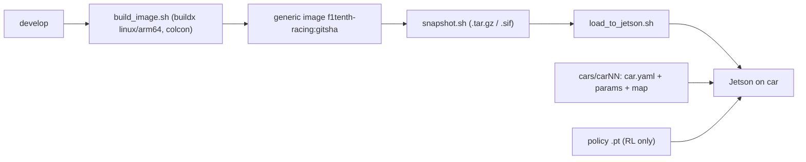

# deploy/

Everything needed to turn `develop` into a running car, plus offboard training
images.

## Layout

- `docker/` — layered images off one base:
  - `Dockerfile.base` — ROS 2 Humble + all deps + tooling (rarely changes).
  - `Dockerfile.dev` — base + dev conveniences; source mounted live (see
    [`tools/dev.sh`](../tools/dev.sh)).
  - `Dockerfile.runtime` — base + a baked colcon install. The **generic car image**.
  - `entrypoint.sh` — sources ROS + workspace and applies the mounted per-car overlay.
- `apptainer/` — `training.def` (HPC RL training) and `racing.def` (run the racing
  image where Apptainer is preferred).
- `cars/` — per-car config overlays (identity + params + map). See
  [`cars/README.md`](cars/README.md).
- `releases/manifest.csv` — git SHA -> image sha256 -> car, for traceability.
- `scripts/` — `build_image.sh`, `snapshot.sh`, `load_to_jetson.sh`.
- `snapshots/` — built image artifacts (gitignored).

## Release flow

1. Build the generic image from `develop` (tagged by git SHA).
2. Snapshot it to a portable artifact and record it in `releases/manifest.csv`.
3. Load it onto the Jetson and run with the per-car overlay mounted at `/config`
   and the RL policy at `/policies`.

A release is a git tag on `develop` (e.g. `racing-v<ver>`) whose exact image is
snapshotted. See [`../docs/deployment.md`](../docs/deployment.md).
