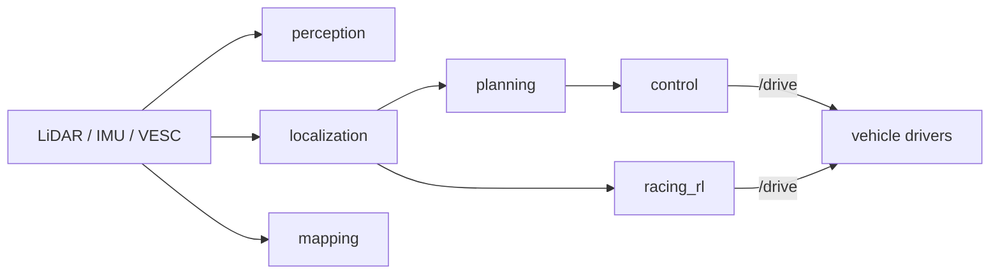

# Domain context

Shared background for anyone (human or agent) working in this repo: what we are
building, where the ideas come from, and the core problems each part solves. Read
this once before touching code. For the design and rationale see
[`../ARCHITECTURE.md`](../ARCHITECTURE.md).

## What F1TENTH is

F1TENTH is an open 1/10th-scale autonomous racing platform. The car is a
small Ackermann-steered RC chassis carrying real autonomy sensors and compute:

- A planar **LiDAR** (primary perception), an **IMU**, and wheel/motor feedback
  from a **VESC** motor controller.
- An on-board **NVIDIA Jetson** that runs the full stack in real time.

Races come in two flavours: solo **time trial** (fastest lap) and **head-to-head**
(overtake and defend without crashing). The hard part is the same one full-scale
autonomy faces, compressed onto cheap hardware: close the
**perception -> planning -> control** loop fast enough to drive at the friction
limit, on constrained compute, while reacting to an opponent. Everything targets
**ROS 2 Humble** and is developed in Docker (see
[`development.md`](development.md)).

## GT Sophy: the RL lineage

Our reinforcement-learning stack is shaped by the ideas in **GT Sophy** (Wurman
et al., "Outracing champion Gran Turismo drivers with deep reinforcement
learning," *Nature*, 2022), which trained a superhuman racing agent in the Gran
Turismo simulator. The pieces we deliberately mirror:

- **Algorithm: QR-SAC** — a distributional (Quantile-Regression) variant of Soft
  Actor-Critic. Ours lives in [`../training/qrsac/`](../training/qrsac/).
- **Hand-designed observation** — car state (velocity, acceleration, yaw rate),
  the track geometry ahead (curvature / boundary distances), and, for wheel-to-
  wheel racing, opponent-relative features. Ours is the single source of truth in
  [`../libs/f1tenth_contract`](../libs/f1tenth_contract/) (a 380-dim base vector
  plus an optional 7-dim opponent block).
- **Reward shaping** — progress along the track, staying within the boundaries,
  and penalties that encourage clean, rule-abiding overtakes rather than
  collisions.
- **Sim-to-real via domain randomization** — the policy trains against randomized
  physics so it transfers to the real car. The training environment is in
  [`../training/f1tenth_env/`](../training/f1tenth_env/).

The point of the reference is orientation: when you touch the observation, the
reward, or the trainer, this is *why* it is shaped the way it is.

## Our autonomy stack and the core problems

The monorepo hosts **two racing approaches** that share the same perception,
mapping, and localization modules:

- **Algorithmic racing** (`src/racing_algo/`, `src/planning/`, `src/control/`) —
  a classical pipeline: optimize a global raceline, then track it with
  pure-pursuit. Transparent and tunable.
- **RL racing** (`src/racing_rl/`, trained in `training/`) — an end-to-end policy
  that maps the observation straight to a drive command. It can run standalone.

The core problems, by module:

| Problem | Where it lives |
| --- | --- |
| State estimation (where am I on the track?) | `src/localization/` (particle filter) |
| Track mapping | `src/mapping/` (SLAM) |
| Opponent detection | `src/perception/` (from LiDAR) |
| Global raceline / planning | `src/planning/` |
| Real-time tracking control | `src/control/` (pure-pursuit + drive layer) |
| End-to-end policy inference | `src/racing_rl/` |
| **Sim-to-real observation parity** | [`../libs/f1tenth_contract`](../libs/f1tenth_contract/) + the C++ mirror in `f1tenth_common` |

The last row is the subtle one: a policy trained in sim only works on the car if
the deployed observation is **bit-for-bit** the one it trained on. That is why the
observation/action layout is a single source of truth with a C++ parity test —
see [`observation_contract.md`](observation_contract.md).
