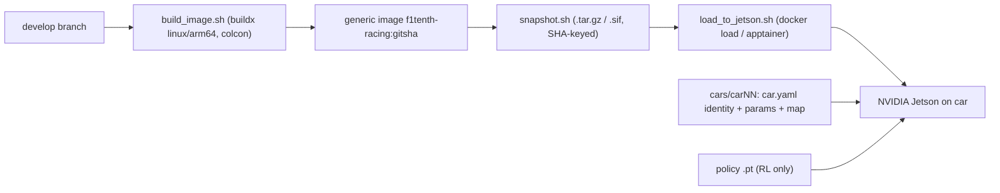

# Deployment

How a commit on `develop` becomes a running car.

## Principle: one generic image, per-car config at runtime

Every `develop` commit can be built into a **generic** car image, keyed by git SHA,
that contains no per-car configuration and no policy weights. Per-car identity,
parameters, maps, and the RL policy checkpoint are supplied at runtime by mounting
them into the container. So a single image serves every car, and a car's identity is
never overwritten by a deploy.



## Steps

1. **Build** the generic image for the Jetson architecture:

   ```bash
   deploy/scripts/build_image.sh          # tags f1tenth-racing:<gitsha> and :develop
   ```

   Uses `docker buildx --platform linux/arm64` (QEMU emulation on x86 hosts) and a
   multi-stage `Dockerfile.runtime` that colcon-builds the racing packages.

2. **Snapshot** it to a portable, SHA-named artifact (no registry needed):

   ```bash
   deploy/scripts/snapshot.sh             # -> deploy/snapshots/f1tenth-racing-<gitsha>.tar.gz
   ```

   Record the result in [`../deploy/releases/manifest.csv`](../deploy/releases/manifest.csv)
   (`git_sha,image_sha256,car_id,deployed_at,notes`).

3. **Load** it onto the car and run with the per-car overlay:

   ```bash
   deploy/scripts/load_to_jetson.sh user@car01 deploy/snapshots/f1tenth-racing-<gitsha>.tar.gz car01
   ```

   On the car:

   ```bash
   docker run --rm -it --net=host --privileged \
     -v /dev:/dev \
     -v /opt/f1tenth/config:/config:ro \
     -v /opt/f1tenth/policies:/policies:ro \
     f1tenth-racing:develop
   ```

   `-v /dev:/dev` is required: `--privileged` exposes device *nodes* (e.g.
   `/dev/ttyACM0`) but not the udev *symlinks* the drivers use (`/dev/sensors/vesc`,
   LiDAR, joystick). Mounting host `/dev` brings those stable symlinks into the
   container so `vesc_driver` (and the LiDAR/joy nodes) open their configured ports.

## Per-car config

Lives in [`../deploy/cars/`](../deploy/cars/). Each `carNN/` has:

- `car.yaml` — identity, authored on the car, **never overwritten**.
- `params.yaml` — **node-scoped ROS 2 parameters** (keyed by node name with a
  `ros__parameters` block) layered on top of the package launch defaults. Covers the
  RL `drive` limits, `vehicle_obs` observation mode (392-dim solo, opponent block
  zeroed), and the vendored VESC calibration. It is passed directly to the nodes —
  `race.launch.py` forwards it as `overlay_params_file:=/config/params.yaml` and
  `car.launch.py` as `vesc_config:=/config/params.yaml`; there is no custom parser.
- `maps/` — occupancy grid + centerline/raceline for the current track (`map.yaml`,
  `centerline.csv`, `raceline.csv`).

The same image runs the algorithmic or RL stack; select with `stack:=rl` (default)
or `stack:=algo`. The RL policy is mounted read-only at `/policies/policy.pt`.
`race.launch.py` starts vehicle drivers, particle-filter localization
(`enable_localization:=true`), and a read-only `localization_preflight` health check.
The RL graph emits no drive command until pose + twist are live.

**Checkpoint compatibility:** policies trained under the legacy on-car 387-dim layout
are not compatible with the monorepo 392-dim contract; retrain before RL deploy.

## Certification gate (f1tenth_gym)

Before a release, the stack is certified against the `f1tenth_gym` bridge with a
real 392-dim checkpoint. The on-car C++ autonomy graph (`vehicle_obs` →
`policy_inference` → `drive`) is the sole gate. All commands run from the repo root.

1. **Contract, parity, unit (host `.venv`)** — the 392-dim contract and the
   training↔deploy observation parity:

   ```bash
   PYTHONPATH="libs/f1tenth_contract:src/racing_rl/f1tenth_rl_agent:training" \
     .venv/bin/python -m pytest \
       libs/f1tenth_contract/test/test_contract.py \
       src/racing_rl/f1tenth_rl_agent/test/test_contract_parity.py \
       src/racing_rl/f1tenth_rl_agent/test/test_quasi_static_load.py
   NUMBA_DISABLE_JIT=1 PYTHONPATH="libs/f1tenth_contract:src/racing_rl/f1tenth_rl_agent:training" \
     .venv/bin/python -m pytest src/racing_rl/f1tenth_rl_agent/test/test_obs_parity.py
   ```

2. **Build + ROS/C++ tests (dev container)** — the C++ obs/action mirror, tyre
   slip/load math, fixture parity, node integration, and drive-watchdog / bad-obs
   safety tests:

   ```bash
   ./tools/build.sh -t racing_rl
   ./tools/test.sh --packages-select f1tenth_common f1tenth_rl_vehicle f1tenth_rl_agent f1tenth_control
   ```

3. **Closed-loop gym gate (multi-container)** — the exact on-car C++ graph against
   gym physics with a real checkpoint, then the automated acceptance validator:

   ```bash
   CHECKPOINT_DIR=/abs/dir CKPT=policy.pt tools/sim.sh up      # (leave running)
   CHECKPOINT_DIR=/abs/dir CKPT=policy.pt \
     VALIDATE_ARGS="--duration-s 600 --min-samples 2000" tools/sim.sh validate
   ```

4. **Runtime-image gym gate** — the same acceptance from the *built* generic image
   with the per-car overlay, so `/config` + `/policies` wiring is exercised:

   ```bash
   deploy/scripts/build_image.sh
   CHECKPOINT_DIR=/abs/dir CKPT=policy.pt CONFIG_DIR=deploy/cars/car01 \
     STACK=vehicle MODE=release tools/sim.sh up
   ```

### Acceptance criteria (validator PASS)

- observations are all finite and exactly 392-dim; actions in `[-1, 1]`; drive
  `acceleration` in `[-1, 1]`, `speed == 0`, and `|steer|` within `max_steer`;
- the car moves (odom speed above the floor for enough samples);
- the opponent block `[384:392)` stays zero in solo mode;
- ≥ 3 consecutive IV_2026 laps and a 10-minute soak with no process exits and no
  watchdog trips during normal operation;
- policy-loss and non-finite-input fault tests command a safe brake within the
  ~0.30 s (3-cycle @ 10 Hz) drive watchdog (covered by the `f1tenth_control` node
  tests).
- checkpoints must be `policy_format_version >= 2` with `longitudinal_mode: force`
  (speed-trained artifacts are rejected at load).

Retain the validator stdout and the sim/agent container logs (`tools/sim.sh logs`)
with the run, and record the release in
[`../deploy/releases/manifest.csv`](../deploy/releases/manifest.csv).

### Remaining prerequisite before a powered on-car run

Current/force rollout (ADR 0006) requires a fresh force-trained checkpoint with a
new `obs_norm` (`policy_format_version >= 2`). Do not deploy a speed-trained
policy. Stage on-car certification only after Part 2 current/brake calibration
and these gates: boxed wheels at conservative `i_*_max_a` → low-speed floor with
manual estop/deadman checks → braking-distance and acceleration characterization
→ raise limits only within the calibrated/simulated envelope. Promote the
single-mode build and calibrated `deploy/cars/car01/params.yaml` together.

Confirm `deploy/cars/car01/params.yaml` has measured VESC servo gains
(`steering_angle_to_servo_*`) and bench-safe current limits before any powered
run. Sensor-policy deploy uses delta steering; set `steering_action_mode: delta`
and matching `steering_delta_max_rad` on the sensor racer.

### On-car slip/load calibration (first powered test)

IMU sign and filter tuning happens on the ground, not in the gym bridge (which has no
`/sensors/imu/raw`). During the first powered shakedown at conservative
`vesc_actuator.i_drive_max_a` / `i_brake_max_a` (boxed wheels, then low-speed floor):

1. Constant-speed roll → rear slip ratios near 0.
2. Throttle step → rear κ responds.
3. Hard turn → load transfer visible in `[380:384)`.
4. Tune `imu_ax_sign`, `imu_ay_sign`, `imu_yaw_rate_sign`, `vy_filter_tau_s`,
   `vx_ground_lp_alpha`, and `slip_speed_min_mps` from a rosbag if channels look
   wrong post-`obs_norm`.

## Sensor-policy experiment (1097-D recurrent + current gate)

Isolated from the 390-D racing path (ADR 0008). Same per-car `/config` overlay;
different image name, moving tag, launch, and checkpoint filename.

### What it runs

`sensor_policy.launch.py` starts vendored sensor drivers, `joy_teleop`,
`rl_deadman_gate`, optional safety brake, `sensor_racer`, and `rl_current_gate`.
`rl_current_gate` is the **sole** publisher of VESC motor/brake/servo commands.
It does **not** start PF, map server, SLAM, `ackermann_mux`, Ackermann-mode
`vesc_actuator`, or the 390-D RL graph.

Staged enable flags support non-powered certification:

- `enable_drivers:=false` — no serial/LiDAR/joy nodes
- `enable_racer:=false` — no inference node
- `enable_gate:=false` — no VESC command publisher

First-run current limits default to **5 A** via launch args (`i_drive_max_a`,
`i_brake_max_a`, `i_brake_safe_a`). The launch passes the same drive/brake limits
to both `sensor_racer` and `rl_current_gate`; keep the two node-scoped values equal
in the per-car overlay.

Record `/sensor_racer/diagnostics` and `/rl_current_gate/diagnostics` during dry
runs. They expose applied ownership, consecutive SAFE ticks, GRU reset reasons,
and gate rejection totals/reason counters. A drive- or brake-limit rejection
means the producer and gate limits are not aligned and must remain fail-closed.

### Build / snapshot / load (SHA-pinned, native arm64)

Requires a Docker-capable **linux/arm64** host (Jetson or arm64 builder). The NGC
`-igpu` base is arm64-only; this amd64 dev host cannot certify the image.

Initialize the range_libc submodule before building:

```bash
git submodule update --init src/localization/range_libc
```

```bash
# 1) Build (tags f1tenth-sensor-policy:<gitsha> and :sensor-policy)
TARGET=sensor_policy deploy/scripts/build_image.sh

# Base pin (Jammy / CUDA 12.6 / ROS 2 Humble):
# nvcr.io/nvidia/pytorch@sha256:c652f021080c2d327fe7c14ae898fef1ba7dd3b756f15bff1455612f32b7cc0c

# 2) Non-powered smoke on the build host (Jetson, after build):
SMOKE=1 TARGET=sensor_policy deploy/scripts/build_image.sh
# Optional: CHECKPOINT_PATH=/path/to/policy.pt SMOKE=1 ...

# 3) Snapshot
TARGET=sensor_policy deploy/scripts/snapshot.sh
# -> deploy/snapshots/f1tenth-sensor-policy-<gitsha>.tar.gz

# 4) Inventory + load (never overwrites :develop or policies/policy.pt)
TARGET=sensor_policy \
  CHECKPOINT=training/outputs/runs/7210e365/checkpoints/policy_271360000.pt \
  ACTOR_LAYOUT=2 POLICY_FORMAT=4 JETPACK_L4T=R36.4.7 \
  deploy/scripts/load_to_jetson.sh shereef@f1tenth \
  deploy/snapshots/f1tenth-sensor-policy-<gitsha>.tar.gz car01
```

Load records the previous `:sensor-policy` tag, checkpoint path, and Torch/CUDA pins
under `/opt/f1tenth/rollback/sensor_policy/` and appends `deploy/releases/manifest.csv`.

### Run / dry-run / smoke / rollback

```bash
# On the car (helper written by load_to_jetson.sh):
ssh shereef@f1tenth /opt/f1tenth/rollback/sensor_policy/run.sh

# Explicit dry-run (VESC topics -> *_dryrun; no drivers/gate/racer):
docker run --rm -it --runtime nvidia --privileged --net=host \
  -v /dev:/dev \
  -v /opt/f1tenth/config:/config:ro \
  -v /opt/f1tenth/policies:/policies:ro \
  f1tenth-sensor-policy:sensor-policy \
  ros2 launch f1tenth_bringup sensor_policy.launch.py \
    dry_run:=true device:=cuda \
    enable_drivers:=false enable_gate:=false enable_racer:=false

# Non-powered image smoke (CUDA + artifact + inventory + launch parse):
docker run --rm --runtime nvidia \
  -v /opt/f1tenth/policies:/policies:ro \
  --entrypoint smoke_sensor_policy.sh f1tenth-sensor-policy:sensor-policy

# Rollback moving tag to the pre-load image:
deploy/scripts/rollback_jetson.sh shereef@f1tenth sensor_policy
```

Logs: container stdout plus on-car `tegrastats` / rosbag as required by the 10 Hz
gate. Keep racing rollback available via
`deploy/scripts/rollback_jetson.sh shereef@f1tenth racing`.

## Releases

A release is a git tag on `develop` (e.g. `racing-v<ver>`). Build + snapshot that
exact commit and note the tag in the manifest. There is no release branch.
Sensor-policy experimental loads use the same manifest with `sensor_policy` in
the notes column; they do not replace a racing release tag.

## Offboard training (HPC)

RL training can run on HPC via Apptainer:

```bash
apptainer build training.sif deploy/apptainer/training.def
apptainer run --nv training.sif --num-envs 1024 --total-steps 2000000
```

Weights produced there are delivered to the car as the mounted `/policies/policy.pt`
— they are never baked into the image.
