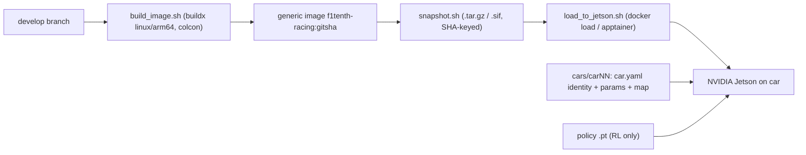

# Deployment

How a commit on `develop` becomes a running car.

## Principle: one generic image, per-car config at runtime

Every `develop` commit can be built into a **generic** car image, keyed by git SHA,
that contains no per-car configuration and no policy weights. Per-car identity,
parameters, maps, and the RL policy checkpoint are supplied at runtime by mounting
them into the container. So a single image serves every car, and a car's identity is
never overwritten by a deploy.



## Steps

1. **Build** the generic image for the Jetson architecture:

   ```bash
   deploy/scripts/build_image.sh          # tags f1tenth-racing:<gitsha> and :develop
   ```

   Uses `docker buildx --platform linux/arm64` (QEMU emulation on x86 hosts) and a
   multi-stage `Dockerfile.runtime` that colcon-builds the racing packages.

2. **Snapshot** it to a portable, SHA-named artifact (no registry needed):

   ```bash
   deploy/scripts/snapshot.sh             # -> deploy/snapshots/f1tenth-racing-<gitsha>.tar.gz
   ```

   Record the result in [`../deploy/releases/manifest.csv`](../deploy/releases/manifest.csv)
   (`git_sha,image_sha256,car_id,deployed_at,notes`).

3. **Load** it onto the car and run with the per-car overlay:

   ```bash
   deploy/scripts/load_to_jetson.sh user@car01 deploy/snapshots/f1tenth-racing-<gitsha>.tar.gz car01
   ```

   On the car:

   ```bash
   docker run --rm -it --net=host --privileged \
     -v /opt/f1tenth/config:/config:ro \
     -v /opt/f1tenth/policies:/policies:ro \
     f1tenth-racing:develop
   ```

## Per-car config

Lives in [`../deploy/cars/`](../deploy/cars/). Each `carNN/` has:

- `car.yaml` — identity, authored on the car, **never overwritten**.
- `params.yaml` — chassis calibration + safety limits + RL policy path.
- `maps/` — occupancy grid + centerline/raceline for the current track.

The same image runs the algorithmic or RL stack; select with `stack:=algo|rl` and,
for RL, point `racing_rl.policy_path` at a mounted checkpoint.

## Releases

A release is a git tag on `develop` (e.g. `racing-v<ver>`). Build + snapshot that
exact commit and note the tag in the manifest. There is no release branch.

## Offboard training (HPC)

RL training can run on HPC via Apptainer:

```bash
apptainer build training.sif deploy/apptainer/training.def
apptainer run --nv training.sif --num-envs 4096 --total-steps 2000000
```

Weights produced there are delivered to the car as the mounted `/policies/policy.pt`
— they are never baked into the image.
