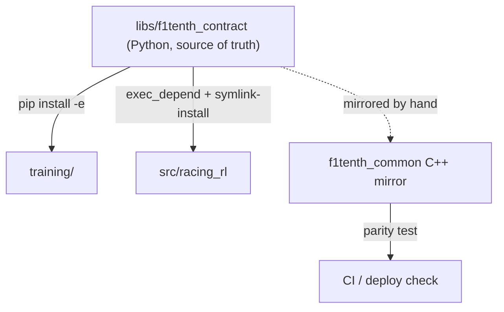

# Observation / action contract

The observation and action layout is the interface between RL training and the
on-car RL inference node. If they disagree, a policy trained in sim behaves
differently on the car. To prevent that, the layout has a **single source of truth**.

## Source of truth

[`libs/f1tenth_contract`](../libs/f1tenth_contract/) — a Python package defining the
observation fields/order/dimensions (`observation.py`) and the action layout
(`action.py`). It is a **dual pip + ament package**: a normal Python package that
also carries a `package.xml`.

## Who consumes it, and why there are no rebuilds

- **Training** (`training/`) installs it editable:

  ```bash
  pip install -e libs/f1tenth_contract
  ```

  Editing the observation space is picked up on the next trainer run — no rebuild,
  no reinstall. This is wired into `training/requirements.txt` and
  `training/environment.yml`.

- **On-car inference** (`src/racing_rl`) depends on it via
  `<exec_depend>f1tenth_contract</exec_depend>` and the workspace is built with
  `colcon build --symlink-install`, so Python-only edits need no rebuild either. A
  full colcon build happens only when freezing a car image.

## The C++ mirror

The on-car C++ vehicle node cannot import Python. So a **mirror** of the layout lives
in C++ at
[`src/common/f1tenth_common/include/f1tenth_common/observation_layout.hpp`](../src/common/f1tenth_common/include/f1tenth_common/observation_layout.hpp).

This duplication is intentional and isolated: it is validated by a **parity test**
(`src/common/f1tenth_common/test/test_obs_parity.cpp`) that runs at build/CI time,
decoupled from the training loop. When the Python contract changes, update the C++
mirror and the parity test keeps them honest.



## Layout summary

| Mode | `num_obs` | Opponent block |
| --- | ---: | --- |
| Solo (1v0) | 384 base + zero sentinel | `[384:392)` all zeros |
| 1v1 | 392 | `[384:392)` — 8 dims: `rel_x`, `rel_y`, `rel_vx`, `rel_vy`, `rel_ax`, `rel_ay`, `gap_norm`, `ey_o` |

Block builders emit the 8 relative features with no masking. Relative
acceleration rotates each vehicle’s body-frame `ax,ay` into world coordinates,
subtracts, then rotates into the ego frame. Callers zero the block when the
opponent is out of range (training: ±40 m ahead / 20 m behind on arc length) or
not confidently detected (deploy). An all-zero opponent block is the sole “no
relevant opponent” signal.

## Migration note

The observation math is currently duplicated in three places:

- `F1tenth-Genesis/f1tenth_env/observations.py`
- `F1tenth-Genesis/ros2_deploy/.../obs_core.py`
- `F1tenth-Genesis/ros2_deploy/f1tenth_rl_vehicle/src/rl_obs_core.cpp`

These collapse into `libs/f1tenth_contract` (Python) + the `f1tenth_common` C++
mirror during migration.
